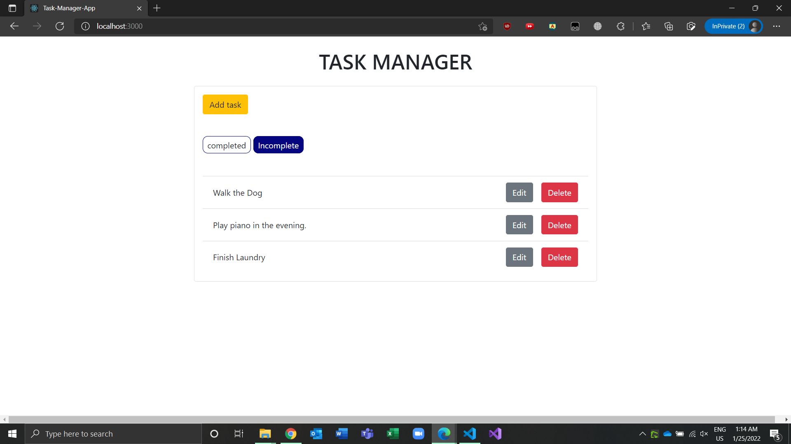
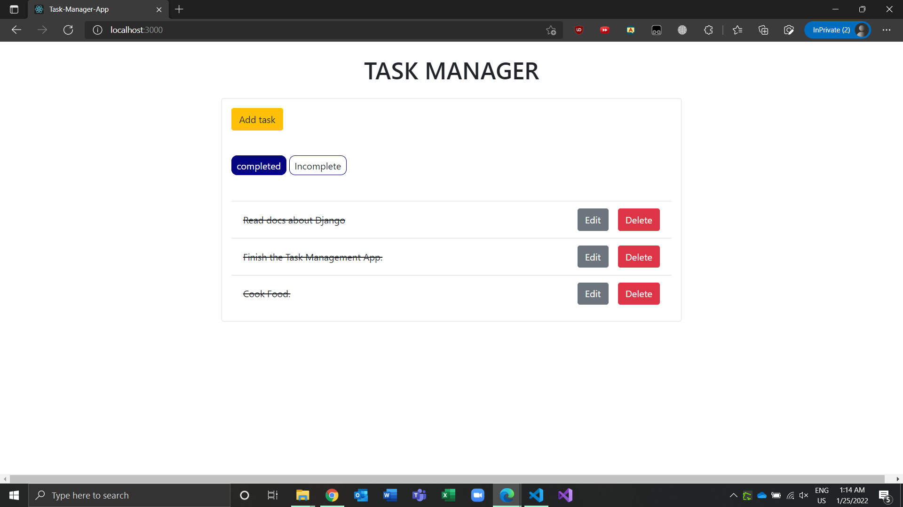
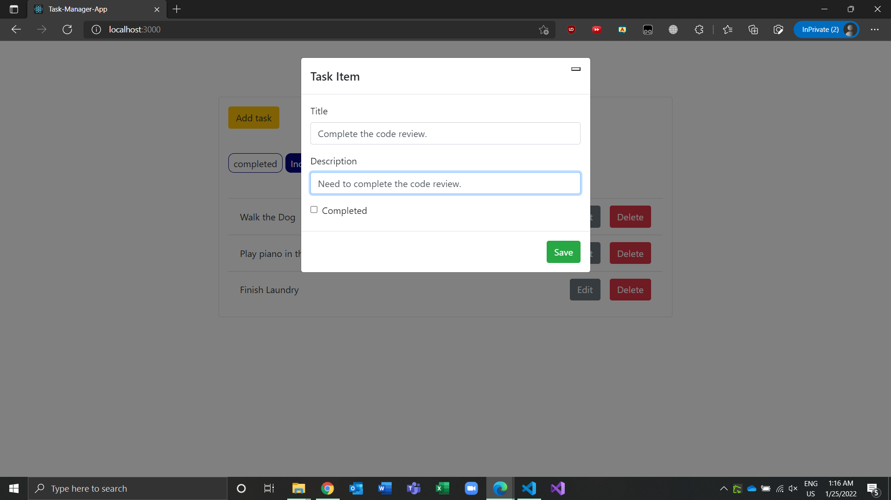
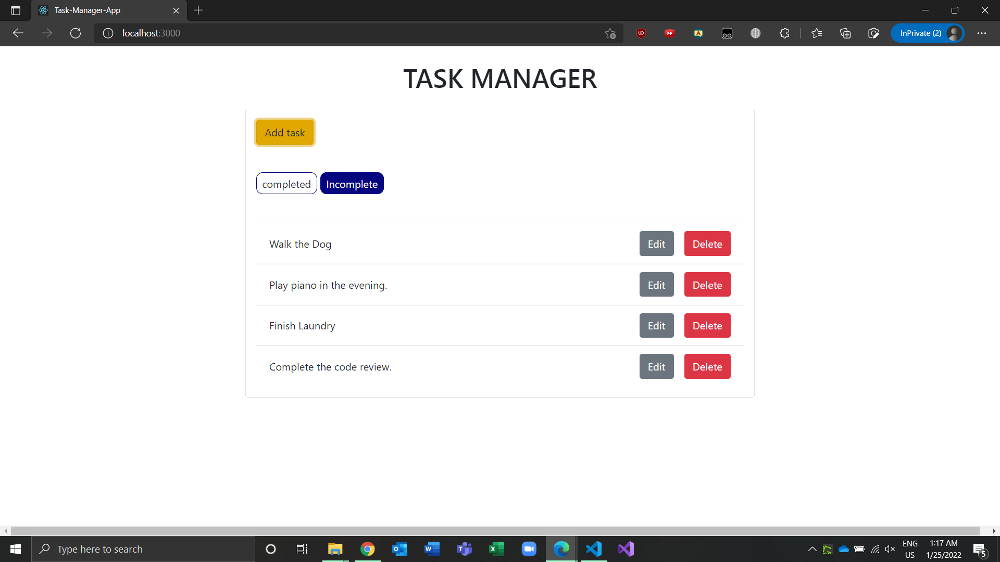
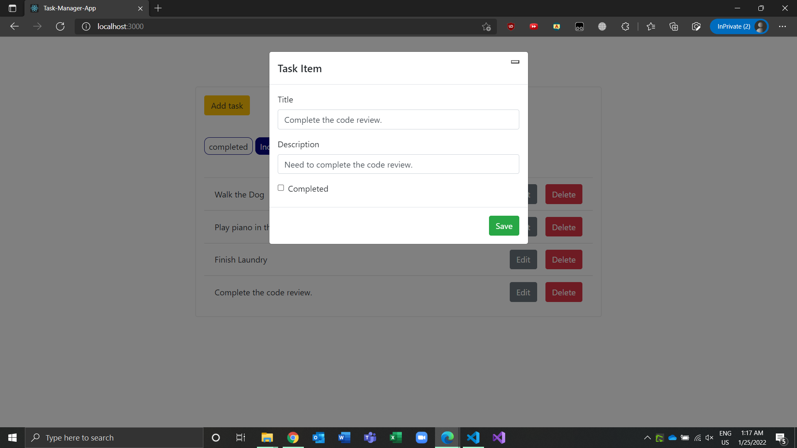
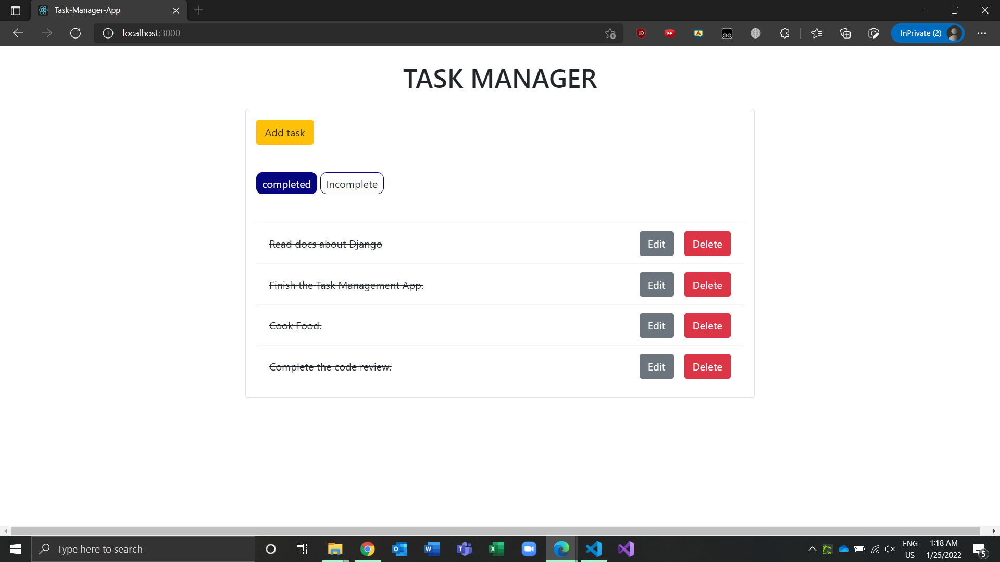

# Task-Manager-App

---

A Todo List Application where backend is built using Django and Django-rest-framework and frontend is built using Reactjs.

# Main Features:

---

- Users can view the completed tasks and incomplete tasks.
- Users can add tasks.
- Users can update tasks.
- Users can delete tasks.

# Screenshots:

---

Home Page Incomplete tasks:



Home Page completed tasks:



Add Task:



Task Added:



Edit Task:



Task Edited:



# Installation and setup instructions:

---

First clone down this repository. You will need node and npm globally installed on your machine. Also to run backend you need python and pip installed on your system.

it is recommended to create a virtual environment for your project. So that all the dependencies will be installed on this virtual environment and not globally.

### Server:

---

##### Setup of Virtual Environment:

If you want all your dependencies installed globally on your machine you can skip this part.

to create a virtual environment and active it first go to the directory where you cloned this repository and type the following commands.

```
$ python -m venv env
$ source env/Scripts/activate
```

now the virtual environment will be activated. To deactivate type

```
$ deactivate
```

##### installation of dependencies:

To install dependencies go to the backend directory and type the following command.

```
$ pip install -r requirements.txt
```

##### migrate:

To migrate run the following commands.

```
$ python manage.py makemigrations
$ python manage.py migrate
```

Now all the database schemas should be created at this point.

##### Start the server:

to start the server type

```
$ python manage.py runserver
```

This will let the server up and running.

##### Create Super User:

You can also create a superuser for your django admin panel. Though this part is optional. To crate a superuser just type the following command.

```
$ python manage.py createsuperuser
```

### Client:

---

To run the client go to the frontend directory and type the following commands.

```
$ npm install
$ npm start
```

Now go to your favorite browser and on the search bar type

```
locahost:3000
```

This will let your app start running.
